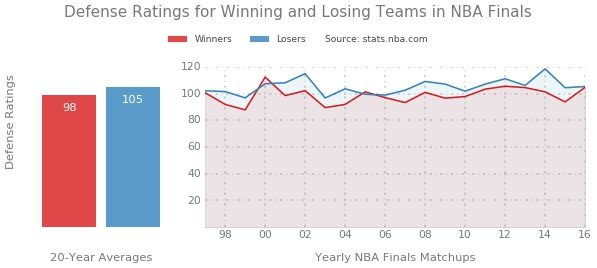

# Does defense win NBA championships?

You may have heard the old cliché that defense wins basketball championships. Superstars like Michael Jordan, who led the Chicago Bulls to six NBA championships, said so. And coaches like Gregg Popovich, who led the San Antonio Spurs to five championships, often emphasize defense.   

To check this, I gathered NBA defense rankings for 40 teams in the NBA Finals over the past 20 years. The rankings are based on each team's performance in these best-of-seven championship series. The data, split into groups of 20 winners and 20 losers, shows winning teams averaged a defense rank of 98 while losers averaged 105. The 7-point difference, while not large, is statistically significant: a t-test produced a p-value of 0.001. 

So the data indicates that, on average, teams with LOWER defense ratings in the NBA Finals are 99.9% more likely to win the championship. This finding contradicts the old cliché that defense wins championships.     

A timeline plotting winner and loser rankings for each yearly Finals showed more surprises. Though the gap in defense ratings among winners and losers was small, teams with higher ratings rarely ever won - doing so in just two of the 20 matchups, in 2000 and 2005. Also, the team with the highest defense rating out of all 20 years ended up losing, in 2014. But the team with the record-lowest defense won, in 1999. Interestingly, ratings for both winners and losers steadily increased over the years.

Sources:

- https://en.wikipedia.org/wiki/List_of_NBA_champions
- http://stats.nba.com/teams/defense/#!?sort=W&dir=-1&Season=2015-16&SeasonType=Playoffs&LastNGames=7

### Running the code

The visualization can be run with plot.py, as long as ratings.csv is in the data folder. To recreate ratings.csv and then run the visualization, run these files in this order:

1. scrape_finals.py - this grabs winners, losers and number of games played in last 20 NBA Finals
2. scrape_ratings.py - this retrieves NBA defense ratings for each team compiled by scrape_finals.py
3. plot.py - this will plot winners and losers rankings overall and in a year timeline